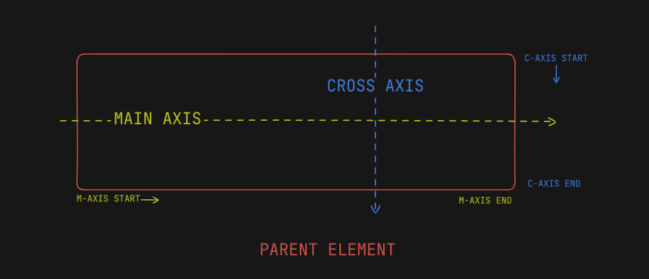

# Flexbox

- Gives the ability to play with the child elements of an element <br><br>

  

```html
<head>
	<style>
		.parent {
			display: flex;
		}
	</style>
</head>
<body>
	<div class="parent">
		<div class="child">Item 1</div>
		<div class="child" id="item2">Item 2</div>
		<div class="child">Item 3</div>
		<div class="child">Item 4</div>
	</div>
</body>
```

- `display: flex` of parent -> gives you ability to play with children of parent
- by default children are aligned on the main axis
  <br>
- `justify-content` -> property used in parent to control the alignment of children along the main axis.

  - Commonly used values are:
    - flex-start
    - flex-end
    - center
    - space-between
    - space-around

  <br>

- `align-items` -> property used in parent to control the alignment of children along the cross axis
  - Commonly used values are:
    - flex-start
    - flex-end
    - center
    - stretch
    - baseline
      <br>
- `gap` -> used in parent to control gap between the children
  <br>
- `flex-wrap` -> used in parent to enable or prevent wrapping of children to the next line
  <br>
- `flex` -> defined in children -> defines ratio of children w.r.t. each other ->

```html
<style>
	.child {
		flex: 1;
	}
	#item2 {
		flex: 2;
	}
</style>
```

now the item2 will occupy twice the size on the screen as compared to other children. flex always signifies the ratio.
If flex is not defined for the elements having class 'child', and flex:2 (2 or anything >0) is defined for #item2, then item 2 occupies all the remaining space.
<br>

- order: used on child element. By default order of each element is 0 -> basically means priority -> value can be a negative integer, 0 or positive integer. lower the value -> more priority the element has -> elements laid out on the axis (main or cross) based on their priority -> lower order value element -> laid out first, then higher, higher , ...highest.
  <br>

- flex-direction: defined on parent -> value can be row, row-reverse, column, column-reverse -> whatever the value of flex-direction is -> that direction becomes the main axis
  - for example: let us say flex-direction is :
    1. row -> main axis -> left to right | cross axis -> top to bottom
    2. row-reverse -> main axis -> right to left | cross axis -> top to bottom
    3. column -> main axis -> top to bottom | cross axis -> left to right
    4. column-reverse -> main axis -> bottom to top | cross-axis -> left to right
       <br>
- align-self: defined on child element -> adjusts the position of individual child along the cross-axis.
  - Commonly used values are:
    - flex-start
    - flex-end
    - center
    - stretch
    - baseline
      <br>
- align-content: used on the parent element -> only valid when `flex-wrap: wrap` is enabled and there are elements in the second line as well i.e. there are so many elements in one line of the main axis that wrapping is done and now some elements have wrapped to the second line or further to third or fourth or so on. -> it basically describes the gap between two or more subsequent lines of wrapped elements on the cross axis -> if there is only one line of elements, this is property will have no effect. Possible values:
  - flex-start
  - center
  - flex-end
  - space-between
  - space-around
  - space-evenly
  - stretch
    <br>
- flex-flow: shorthand to apply two properties in one go i.e. `flex-direction` and `flex-wrap` -> format: `flex-flow: flex-direction flex-wrap` -> for eg.: `flex-flow: column wrap`
  <br>
