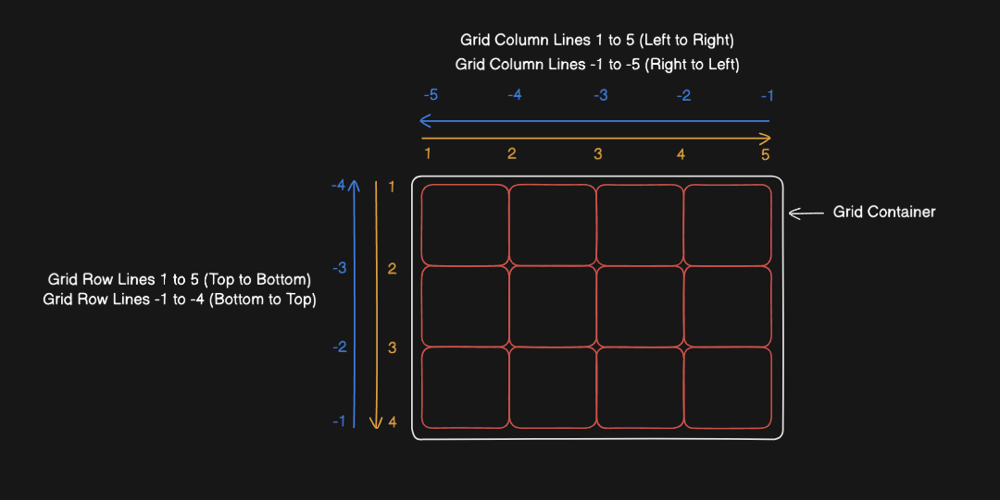
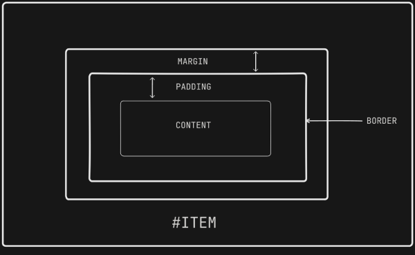

# Grid



- Grid used to control items along two axis - horizontal as well as vertical
- A container is used in which grid is defined by `display: grid` property.
- By default, `display: grid` will create columns and rows, based on the content. But if you want to take control over the layout of the grid i.e. to define the rows and columns of the grid, we use `grid-template-columns` and `grid-template-rows` property in the grid container.

## One way of defining layout and putting items in the Grid:

### Defining Columns:

- `grid-template-columns: 20% 20% 20% 20% 20%` -> creates grid of 5 columns which will occupy 20% of the available area each.
- `grid-template-columns: 100px 100px 100px 100px 100px` -> creates grid of 5 columns which will occupy 100 px each.
- `grid-template-columns: 20% 100px 30% 100px 100px` -> we can use any combination of px, %, em etc to assign the amount of space to be used by each column
- `grid-template-columns: repeat(100, 5%)` -> will create a grid which will have 100 columns, each of which will occupy 5% of the available space.

### Defining Rows:

- `grid-template-rows: 20% 20% 20% 20% 20%` -> creates grid of 5 rows which will occupy 20% of the available area each. Note: This is 20% of the height of the container. So you will have to define the height of the contaier first. Otherwise the rows will be created, but they will not have height, because height is related to the height of the container.
- `grid-template-rows: 100px 100px 100px 100px 100px` -> creates grid of 5 rows which will occupy 100 px each.
- `grid-template-rows: 20% 100px 30% 100px 100px` -> we can use any combination of px, %, em etc to assign the amount of space to be used by each row
- `grid-template-rows: repeat(100, 5%)` -> will create a grid which will have 100 rows, each of which will occupy 5% of the available space.

### Placing Items in the grid

- To place an item in the grid, first select that item using css selector and then, use the following properties in the items:

- `grid-column-start : 1` -> specifies that the item will be placed from the first grid column line.
- `grid-column-end: 5` -> specifies that the item will end at the 5th column line
- `grid-column-start: 5` and `grid-column-end : 3` -> this is also valid. This just means that the item will be placed in two columns.
- `grid-column-start: 2` and `grid-column-end: span 2` -> this means that the item will be placed in two columns

- `grid-row-start : 1` -> specifies that the item will be placed from the first grid row line.
- `grid-row-end: 4` -> specifies that the item will end at the 4th row line
- `grid-row-start: 4` and `grid-row-end : 2` -> this is also valid. This just means that the item will be placed in two rows.
- `grid-row-start: 2` and `grid-row-end: span 2` -> this means that the item will be placed in two rows

#### Shorthands

- `grid-row: grid-row-start / grid-row-end` -> for eg. : if I have to place item from second to fourth row -> `grid-row: 2 / 5` or `grid-row: 2/ span 3`

Similarly

- `grid-column: grid-column-start / grid-column-end` -> for eg. : if I have to place item from first to fourth column -> `grid-row: 1 / span 4`

Now instead of writing separate `grid-row` and `grid-column` -> there is a shorthand for this as well:

- `grid-area: grid-row-start / grid-column-start / grid-row-end / grid-column-end` -> for eg. : In a grid having 5 rows and 6 columns, if we have to place the item in the last row and last column: `grid-area: 5 / 6 / 6 / 7`

## Another way of defining areas and placing items in the grid:

Suppose the HTML struture is as follows:

```html
<div class="container">
	<div class="header areaItems">Header</div>
	<div class="ads areaItems">Ads</div>
	<div class="content areaItems">Content</div>
	<div class="footer areaItems">Footer</div>
</div>
```

- In the grid container's css selector, after putting the display property to be grid, we can define `grid-template-areas` property to semantically represent how many columns and rows each element will take:

### Defining layout

```html
<style>
	.container {
		border: 1px solid;
		display: grid;
		grid-template-areas:
			"h h h"
			"c c a"
			"c c a"
			"f f f";
	}
	.areaItems {
		border: 1px dashed;
	}
</style>
```

- Now based on this, if I really think about it, I can make a guess that, h will take three columns and one row, c will take two columns and two rows, a will take one column and two rows, f will take one row and three columns. The naming should be better instead of 'h', 'a', 'c' and 'f', we should write descriptive names
- Now, upto this point we have defined the layout. Now let's place the items in the grid

### Placing items in the Grid

```html
<style>
	.header {
		grid-area: h;
	}
	.ads {
		grid-area: a;
	}
	.content {
		grid-area: c;
	}
	.footer {
		grid-area: f;
	}
</style>
```

- Now, we map the names that we had given to our areas in the `grid-template-areas` to their corresponding elements by using `grid-area` property

# CSS Box Model



## border-box

Suppose:

```html
<style>
	#item {
		box-sizing: border-box;
		height: 200px;
		padding: 10px;
		margin: 20px;
		border: 5px solid;
	}
</style>
```

- This means that top-margin + top-border + top-padding + content-size + bottom-padding + bottom-border + bottom-margin = 200px i.e.
  - 20px + 5px + 10px + content-size + 10px + 5px + 20px = 200px
  - So content-size = 130px
- This is what is meant by `box-sizing: border-box` -> total height and width is inclusive of margin, border, padding and content sizes

## content-box

Suppose:

```html
<style>
	#item {
		box-sizing: content-box;
		height: 200px;
		padding: 10px;
		margin: 20px;
		border: 5px solid;
	}
</style>
```

- This means that the content height will be 200 px and on top of that all other measurements will be added.
- So, the content will occupy 200 px and including all the margins, border and paddings, the #item will occupy 270px of height

- NOTE: Usually developers at the start of the css file use a \* selector to select all the elements and then inside this `box-sizing: border-box` -> in most cases this is done -> for my purposes also, do this because we do not want to go very deep in css

# Units

## Absolute Units:

- `px` : Absolutely signifies the size. Not relative to other elements

## Relative Units:

- `%`: It is always relative to the parent elements
- `em` : Also relative to the parents. Suppose parent element's size is 50px, and font-size of child is defined to be 2 em. That means the child element's font size will be 2 x 50px = 100 px
- `rem` : Relative to the root element of the html document. In web dev this root element will be `html` element. So if font-size of html element is set to be 20px, then all rem values of the elements in the document will be in multiple of 20px, i.e 2 rem is 40px, 1.5 rem is 30px and so on
- `vh` and `vw` : viewport height and viewport width -> relative to the height and width of the viewport i.e. (visible height and width of the browser)

# position

- `position` can have the following values:
  - static
  - relative
  - fixed
  - absolute
  - sticky
- When any of these values are provided, elements are then positioned using the top, bottom, left and right properties.
- `position: static` : this is the normal default value of elements. Elements are not placed in any special way. They are positioned according to the normal flow of the page. The elements in this property are `not` said to be positioned. If position takes any of the other 4 values (relative, fixed, absolute and sticky), then they are said to be positioned. `top` , `bottom`, `left`, `right` properties have no effect when `position: static`

- `position: relative` : element positioned relative to its normal position.
  - other elements not adjusted to fill gap left by the element whose position is set to be relative. Please note after setting `position: relative` , top, bottom, left or right properties are used to set the position relative to its normal position
  - use:
  ```css
  #item {
  	position: relative;
  	left: 30px;
  }
  ```
- `position: fixed` : element positioned relative to the viewport -> means element always stays in the same place even when the page is scrolled. The top, bottom, right and left properties are used to position the element.

  - The fixed element does not leave a gap in the page, where it would normally have been located
  - use:

  ```css
  #item {
  	position: fixed;
  	bottom: 0px;
  	right: 0px;
  }
  ```

- `position: absolute` : Remember any element which has a position property other than static is said to be <i>positioned</i> . Now if an element has property position to be `absolute` it behaves like fixed but its position is relative to

  - nearest <i>positioned</i> ancestor, instead of
  - viewport
  - use case:

    ```html
    <div class="relative-positioned">
    	<div class="absolute-positioned">I am absolutely absolute-positioned</div>
    </div>
    ```

    ```css
    .relative-positioned {
    	position: relative;
    	width: 500px;
    	height: 500px;
    	border: 1px solid;
    }
    .absolute-positioned {
    	position: absolute;
    	width: 100px;
    	height: 100px;
    	bottom: 0px;
    	right: 0px;
    	border: 1px dashed;
    }
    ```

- If there is no nearest <i>positioned</i> element, `absolute` element is placed relative to the document body and still moves along with the page scrolling.

- `position: sticky` : toggles between `relative` and `fixed`. It is positioned `relative` until a given offset is met in the viewport and then it sticks in place
