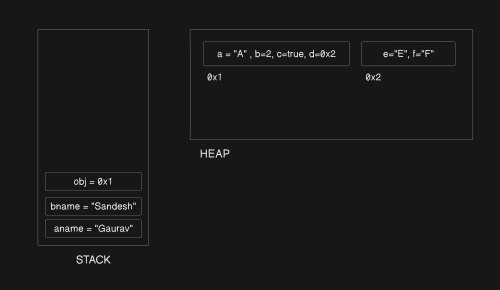
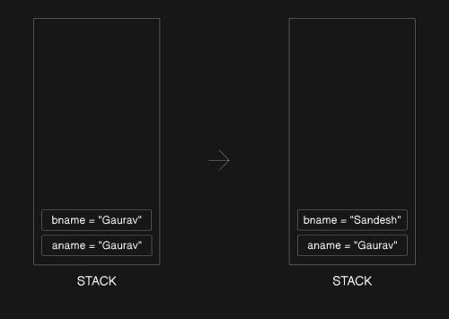
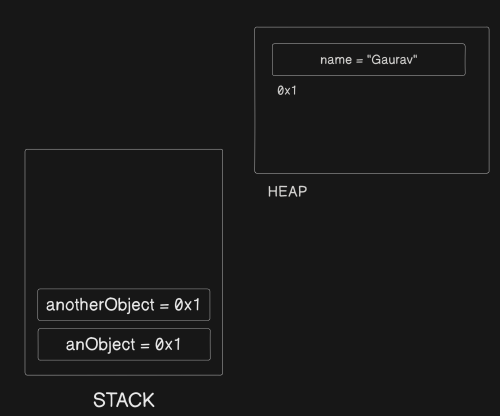

# Javascript

## How to write functions in Javascript:

### One way:

```javascript
function functionName(parameter) {
	console.log(`Hello World ${parameter}`);
}

const functionName = function (parameter) {
	console.log(`Hello World ${parameter}`);
};
```

### Another way: Arrow Functions:

```js
(param1, param2) => {
	console.log(`${param1} and ${param2}`);
};
```

- if there is only one statement in the arrow function and that is a return statement, then there is no need of braces and no need to write `return` as well.

```js
let a = 2;
let b = 4;
const add = (x, y) => x + y;
let callAdd = add(a, b);
console.log(callAdd);

Output: 6;
```

- `this` is not available in arrow functions
- `arguments` is also not available in arrow functions
- This is another way of defining functions.<br><br>

- One thing to note is, even if we do not define parameters in our function definition, if a user passes any argument, they are collected in an array like `arguments` variable. This is not array but array-like object. We can use for loop on it. It has a property `length` as well.
- So,

```js
  const printYourName =  function(){
    console.log(`Hi, my name is ${arguments[0]}`);
  }

  printMyName("Gaurav");

Output:
Hi, my name is Gaurav
```

- But this `arguments` object is not available in arrow functions. So, a better way is to use the `rest parameter`

### rest parameter : ...parameterNameYouLike

- It can be used in both array function definition and regular function definition.
- It is actually an array and not array-like object. So we can use all the methods of array on it like forEach, map etc.
- Basically it collects all the arguments passed to the function.
- It is always the last parameter, function cannot accept any other parameter after this

```js
  const printOurName =  function(...names){
    names.forEach((name)=>{
      console.log(`Hello my name is ${name}`);
    });

  }

  const names = ["ASYadav", "Suman Yadav", "Surender Singh", "Santosh Yadav", "Anita Yadav", "Chanderbhan Yadav"];
  printOurName("Gaurav", "Sandesh", "Divya", "Aakash", "Sumit", "Neetu", ...names);

Output:
Hello my name is Gaurav
Hello my name is Sandesh
Hello my name is Divya
Hello my name is Aakash
Hello my name is Sumit
Hello my name is Neetu
Hello my name is ASYadav
Hello my name is Suman Yadav
Hello my name is Surender Singh
Hello my name is Santosh Yadav
Hello my name is Anita Yadav
Hello my name is Chanderbhan Yadav
```

## Defining Variables

- `let` and `const` are used to define variables

## Data Types in Javascript

- Primitive:
  - String : "Hello", 'Hello', `Hello`
  - Number : 123, 123.5
  - Boolean : true, false
  - Null : space given in the memory but nothing in it
  - Undefined : baad mein dekhenge
  - Symbol
  - BigInt </br></br>
- Non-Primitive : Non-Primitives are also called object:
  - Array
  - Object </br></br>

### Array:

#### Ways in which an array can be defined:

- let fruits = ["apple", "mango", "guava"];
- let intFruits = new Array("Avacado", "DragonFruit");

## Other things

- `typeof` - operator used to know the data type of the operand passed to it.

```javascript
const fruits = ["firstItem", "secondItem"];
const obj = {
	firstkey: "firstValue",
	secondKey: 123,
	anotherKey: true,
};
let gaurav;
console.log(typeof null); // object
console.log(typeof "Hello"); // string
console.log(typeof 123); // number
console.log(typeof true); // boolean
console.log(typeof gaurav); // undefined
console.log(typeof fruits); // object
console.log(typeof obj); // object
```

- A historically known bug of js is `typeof` operand returns data type of `null` to be an `object` .
- question: what is the data type of function: `typeof` operand returns data type of function to be "function". Come back to it when you find out why. Sir told us that there are only two data types: primitive and non-primitive. so, what is "function"?
- Javascript is an object oriented language

## Conditionals

```javascript
if (condition) {
} else {
}
```

## Loops

- `for loop`

```javascript
for(let i=0; condition; loop counter){
  //do something
}
```

buffer website for css

## Data Structure in JS

- Data Structure is how you organise different types of data that you have like array, object, map, set, stack, queue, Linked List, Tree etc
- Primitive: comes out of the box in js like Array, Object, Map, Set, WeakMap, WeakSet
- Non-Primitive: We have to write implementation of these using primitive data structures as building blocks like stacks. They don't come out of the box in js. for eg: Stack, Queue, Linked List, Tree, Graph, Hash Table

### Why are Array and Object Data Type as well as Data Structure?

- If we look via the perspective of language (JS), anything that is not a primitive is an 'Object' type.
  - So, `{}` is an object type
  - and, `[]` is also an object type (an array is just a special kind of object).
- So, from language specification,

  - `typeof {}` -> "object"
  - `typeof []` -> "object"

- If we look via the perspective of computer science,
  - Array organises data in order with indices
  - Object organises data in key value pairs <br>
- So, depending upon the lens that we are looking from, they can have a dual role. <br><br><br>

### Objects:

- defined in curly braces: `const obj1 = {a:"A", b:2,c: false}` : called object literal
- can also be defined as : `const obj2 = new Object({a:"A", b:2,c: false})`

#### Two ways of accessing properties in the object:

```js
const person = {
  firstName: "Gaurav",
  lastName: "Yadav",
  hobbies: ["listening Sitar", "identifying perfumes", "filing RTIs"],
  isMarried: true,
  getFullName: function(){
    return this.firstName + this.lastName;
  }

  address: {
    hno:1,
    street:1,
    countryCode: "IN",

  }
}
```

- In the above example : if firstName is to be printed: `console.log(person.firstName)` i.e. propertied can be accessed using dot operator
- another way is : `console.log(person["hobbies"])` i.e. `objectName["propertyname"]` . This way is used when there is space or starts with a number or has special character other than `_ and $`
- Bracket syntax is also used when keyName is dynamic.

#### How to delete a property from the object: Interview Question

- `delete` operator is used to delete a property from the object
- `delete person.isMarried` : will delete the `isMarried` property from the object

#### for .. in loop

- Used for looping through object properties.

```js
const anObject = {
	a: "A",
	b: 22,
	c: true,
	d: {
		e: "E",
		f: "F",
	},
};

for (let key in anObject) {
	console.log(anObject[key]);
}
```

- Output:

```js
A
22
true
{ e: 'E', f: 'F' }
```

#### Static Methods vs Instance Methods:

- Static methods are called on the class itself, not on the objects created from the class.
- Instance methods are aclled on the instances (objects) of the class, not on the class directly.

#### Object.values(anObject) (Static Method):

- returns an array of values of the keys of the object
  `[ 'A', 22, true, { e: 'E', f: 'F' } ]`

#### Object.entries(anObject) (Static Method):

- returns an array of key value pairs on the object. Each array consists of key (string) at the first position and value at the second location.

```js
[
	["a", "A"],
	["b", 22],
	["c", true],
	["d", { e: "E", f: "F" }],
];
```

#### hasOwnProperty(prop) (Instance Method):

- returns true or false based on whether the object on which it is called has the `prop` property
- `prop` is the string name of the property to test

#### Another way to check whether a particular property is present in the object:

```js
const pen = {
	name: "Reynolds",
	color: "Black",
	make: "Plastic",
	price: 25,
};
```

- check whether `pen` object has the `make` property
- `console.log(pen.hasOwnProperty("make"))`
- `console.log("make" in pen)`
- Both return true
- `in` operator checks for the property anywhere in the prototype chain, while `hasOwnProperty` checks only in the object itself
- One more way to check this : `console.log(pen.make!== undefined)`
- This fails when the value of the property has been explicitly set to `undefined`

#### Merge two objects into one : Use of spread operator:

```js
const oneTea = {
	name: "Green Tea",
	type: "Caffeniated",
	origin: "China",
	like: false,
	anew: "hell",
};

const anotherTea = {
	name: "Badam Tea",
	type: "Non-Caffeniated",
	origin: "Rewari",
	like: true,
	sys: "sterk",
};

const oneObject = { ...oneTea, ...anotherTea };

console.log(oneObject);

Output:

{
  name: 'Badam Tea',
  type: 'Non-Caffeniated',
  origin: 'Rewari',
  like: true,
  anew: 'hell',
  sys: 'sterk'
}
```

- When two objects have common keys, then the value of first object get overwritten by the values of second object, all the unique keys properties are added to the merged object.

#### Stack Memory vs Heap Memory

- Whenever variables are created, they are stored in memory. The memory model has two main parts:

  - Stack
  - Heap

- Stack:

  - Very fast to access.
  - Has limited size (can overflow).
  - Stores function calls, local variables, and references to objects in the heap.

- Heap:

  - Slower to access than stack.
  - Dynamically growable, managed by garbage collector.
  - Stores objects, arrays, and functions.

- In JavaScript:
  - Primitive values (number, string, boolean, null, undefined, symbol, bigint) are stored directly in the variable (typically on stack if standalone).
  - Non-primitive values (objects, arrays, functions) are always stored in the heap.
  - For objects/arrays, the variable itself (on the stack) holds only a reference (pointer) to the actual data in the heap.

for eg:



```js
let aname = "Gaurav";
let bname = "Sandesh";
const obj = {
	a: "A",
	b: 2,
	c: true,
	d: {
		e: "E",
		f: "F",
	},
};
```

- Since `aname` and `bname` are primitive data types, they are directly stored on the stack, while in the case of obj which is a non-primitive data type, actual object is stored on the heap, let us suppose at `0x1`, so the obj variable is stored on stack and reference to the object is stored in it i.e. `0x1` .
- If we look at the `0x1` address in the heap, we can see that inside the object, the primitives, `a, b and c` are stored at `0x1` address while, the `d` key is an object, so, the `d` object is actually placed somewhere else in the heap, let us say at `0x2`, so at `0x1` heap memory, d key holds the reference to the actual `d` object i.e. `0x2`.

#### How different data types are copied

##### How primitive data types are copied: Copy by value



```js
let aname = "Gaurav";
let bname = aname;

console.log(bname); // Gaurav
console.log(aname); // Gaurav

bname = "Sandesh";

console.log(bname); // Sandesh
console.log(aname); // Gaurav
```

- Suppose, we defined one variable `aname` and assigned it the value `Gaurav` . Now on the stack memory we will have a variable aname, whose value is `Gaurav`. Now, if we define a new variable `bname` and assign it `aname` using `=` operator, the value of `aname` is copied in `bname` variable. So, now if we change the value of `bname` to `Sandesh`, only the value of `bname` is changed and the value of `aname` remains unchanged. This is called copy by value.

##### How non-primitive data types are copied: Copy by reference



```js
let anObject = {
	name: "Gaurav",
};

let anotherObject = anObject;

console.log(anotherObject); // {name: "Gaurav"}
console.log(anObject); // {name: "Gaurav"}

anotherObject.name = "Sandesh";

console.log(anotherObject); // {name: "Sandesh"}
console.log(anObject); // {name: "Sandesh"}
```

- Here `anObject` variable is stored in the stack memory but it contains the reference, let us say `0x1` to the actual object which resides on the heap, so when `anotherObject` is assigned the value of `anObject`, actually the reference is copied i.e `anotherObject` has value `0x1`, so now, `anObject` and `anotherObject` both point to the same object on the heap. That is why when value of key `name` is changed via anotherObject, the value of key `name` of `anObject` also gets changed. This is called copy by reference. Reference is copied, not the actual value.

<br>
<br>

#### Shallow Copy vs Deep Copy

##### Shallow Copy:

- Now, if we want to copy an object, it is not feasible to use the `=` operator because it will pass by reference. So, in order to copy an object to another variable, we have to first declare the new variable and then loop throght the object and then copy each value one by one, then only it will be possible to copy the object in a way that changing one value of a key in new object does not change the original object.
- The shorthand for doing this is:

```js
const obj1 = {
	a: 2,
	b: "b",
	c: true,
};

const obj2 = {
	...obj1,
};

const obj3 = {
	a: "A",
	b: 2,
	c: true,
	d: {
		e: "E",
		f: "F",
	},
};
const obj4 = { ...obj3 };
```

- `...` is called spread operator. This means copy each key value pair of obj1 into obj2
- Shallow copy (copying each key value pair) only works if we do not have nested objects inside the object. This happens because as long as we have primitive values, they get copied because they are copied by value, but if we have a nested object inside an object, they get copied by reference and now the same problem will occur, if we change any value inside the nested object in the copied object, the value inside the original object will also get changed. If do `obj4.d.e = "Hello"`, then value of `e` inside obj3 will also get changed to `Hello` . That is why it is called shallow copy.

##### Deep Copy:

- Now, how to copy nested objects?
- We know that non-primitive data types are copied by value, so if somehow we can change the entire object into a string, then the object can be copied and at the time of assigning it to the variable, if we can convert it back to an object, then our purpose will be solved.
- `JSON.stringify()` and `JSON.parse()` are two methods which do the same.
- In the above example, if we do `let obj3String = JSON.stringify(obj3)`,ans we do `console.log(obj3String)` we get `{"a":"A","b":2,"c":true,"d":{"e":"E","f":"F"}}` . Here the object is converted to string.
- Now if we do `const obj5 = JSON.parse(obj3String)` , here the string is converted back to the object and is assigned to the obj5 . Hence the entire nested object is copied by value. This is called deep copy beacuse it copies even the nested objects. Now, `obj3` and `obj5` are two completely different and changing one won't affect the other. <br><br>
- A question arises, whenwe are converting the `obj3` into string, each key-value pair is converted into string one by one and concatenated into the string. Now, talking about obj3, everything was easily converted to string upto `c:true`, because they were all primitive data type, but if we talk about `d` , then it should contain the reference (let us say `0x1`) because it is an object and while converting to string `0x1` is converted to string and `obj3String` should look like this : `{"a":"A","b":2,"c":true,"d":"0x1"}` and if we convert it back to the object, and assign to `obj5` it would again become a shallow copy because `d` is still pointing to the `d` object in heap both in `obj3` and `obj5`.
- This can be a problem in C programming language, but not in javascript because, the engine is smart enough, while using `JSON.stringify()` method, whenever the engine encounters a reference, it works recursively and the pointer gets resolved to the actual value and that value is stored in the string. This is the way deep copy works.

- Garbage collector : When the scope of variables run out and actually there is no pointer pointing towards an object in the heap, then that object needs to be cleared from the heap memory. This is the job of garbage collector. In javascipt we do not have to worry about garbage collection because it is done by the engine itself.

#### Prototypes:

##### Objects

- Representation of real world objects in code.
- It has some functionality and properties

- NOTE: come back at 24:16 in machine coding on Prototypes
- Blog on 1:39:00 - JS Objects and Prototypes

- ## DOM: Document Object Model
- When an HTML document is rendered the browser makes a tree in which everything is a `node`.
- So, you cannot simply add a text inside a `node`, First you have to make a textNode and then append it in another `node` using `appendChild()` method or any other method

- Blog: Events in dom, what they do, what type of events are there, funny take on events connecting them to day to day life, if possible, abalogies of click event, dbl clkick event, browser resizing, mouse position kahan pe hai

- Assignment: 2:07:00
